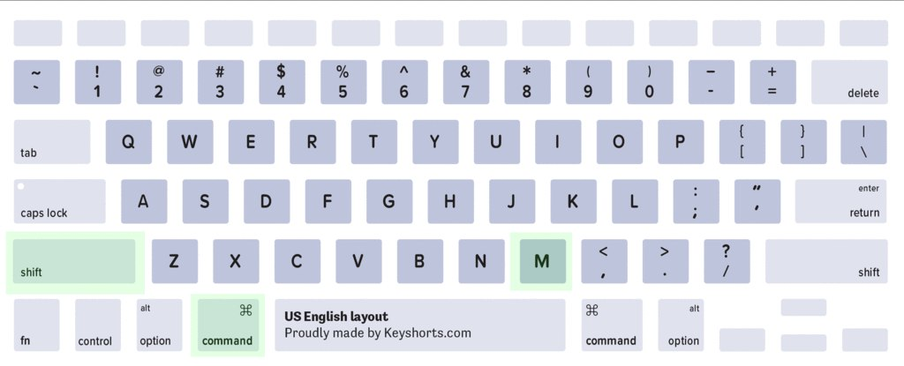

```{r, include = F}
knitr::opts_chunk$set(fig.width = 6, message = FALSE, warning = FALSE, comment = "", cache = FALSE, fig.retina = 3)
library(flipbookr)
library(tidyverse)
library(flair)
library(kableExtra)
```
```{r xaringan-themer, include=FALSE, warning=FALSE}
library(xaringanthemer)
style_duo_accent(
  #base_color = "#43a2ca",
  header_font_google = google_font("Mukta"),#Ubuntu Condensed
  text_font_google   = google_font("Montserrat", "300", "300i"),
  code_font_google   = google_font("Fira Mono"),
  primary_color      = "#0F4C81", # pantone classic blue
  secondary_color    = "#b3e2cd", # pantone baby blue
  #header_font_google = google_font("Raleway"),
  #text_font_google   = google_font("Raleway", "300", "300i"),
  #code_font_google   = google_font("Source Code Pro"),
  text_font_size     = "25px"
#   colors = c(
#   red = "#f34213",
#   purple = "#3e2f5b",
#   orange = "#ff8811",
#   green = "#136f63",
#   white = "#FFFFFF",
# )
)

```

```{r, include=FALSE}
text_spec2 <- function(x = "x"){
  text_spec(x, background = "#b3e2cd", bold = T)
}
```

```{r echo = FALSE}
library(ech) # cargo el paquete
load("data/ech19.RData") #importo los datos
```

# ¿Qué haremos hoy?

- Repaso del segundo taller
<br><br>
--

- Importar archivos sav y dta (haven)
<br><br>
--

- Usar etiquetas en variables categóricas (labelled)
<br><br>
--

- Encadenar funciones: operador %>%
<br><br>
--

- Ejercicios

<!-- - Crear una variable a partir de ciertas condiciones: case_when() -->
<!-- <br> -->
<!-- -- -->

<!-- - Recodificar y renombrar variables -->
<!-- <br> -->
<!-- -- -->


---
class: inverse, center, middle
# TidyveRse

---
class: hide-logo
# tidyverse

.pull-left[

`r text_spec2("Conjunto de paquetes")` para:
<br><br>


`r text_spec2("Importar")`
<br><br>

`r text_spec2("Limpiar y transformar")`
<br><br>

`r text_spec2("Procesar y analizar")`
<br><br>

`r text_spec2("Visualizar")`

 <!-- procesar, analizar y visualizar datos. -->
]
.pull-rigth[
```{r out.width = "300px" ,echo=FALSE}
knitr::include_graphics("https://raw.githubusercontent.com/rstudio/hex-stickers/master/PNG/tidyverse.png")
```
Proporciona una forma unificada, armoniosa y más poderosa de trabajar con datos que la que ofrece el paquete base.
]


---
class: hide-logo
# Importación/Exportación de archivos

.pull-left[

Archivos de `r text_spec2("texto plano")` (txt, csv, tsv)


<!-- {width=180px} -->
```{r out.width = "120px" ,fig.align="center", echo=FALSE}
knitr::include_graphics("https://raw.githubusercontent.com/rstudio/hex-stickers/master/PNG/readr.png")
```

Formatos `r text_spec2("propietarios")` (dta, sav)

```{r out.width = "120px" ,fig.align="center", echo=FALSE}
knitr::include_graphics("https://raw.githubusercontent.com/rstudio/hex-stickers/master/PNG/haven.png")
```

]
.pull-rigth[
<br>
Archivos `r text_spec2("Excel")` (xls, xlsx)

```{r out.width = "120px" ,fig.align="center", echo=FALSE}
knitr::include_graphics("https://raw.githubusercontent.com/rstudio/hex-stickers/master/PNG/readxl.png")
```
<br>

Paquete jsolite, archivos `r text_spec2("JSON")` (JavaScript Object Notation)
```{r out.width = "120px" ,fig.align="center", echo=FALSE}

```

]


---
class: hide-logo
# Manipulación de datos

.pull-left[

`r text_spec2("Trasformar ")` estructura de datos 

```{r out.width = "140px" ,fig.align="center", echo=FALSE}
knitr::include_graphics("https://raw.githubusercontent.com/rstudio/hex-stickers/master/PNG/tidyr.png")
```

Manipular `r text_spec2("texto")`

```{r out.width = "140px" ,fig.align="center", echo=FALSE}
knitr::include_graphics("https://raw.githubusercontent.com/rstudio/hex-stickers/master/PNG/stringr.png")
```

]
.pull-rigth[
<br>
Manipular `r text_spec2("fechas")` 

```{r out.width = "140px" ,fig.align="center", echo=FALSE}
knitr::include_graphics("https://raw.githubusercontent.com/rstudio/hex-stickers/master/PNG/lubridate.png")
```


Manipular `r text_spec2("data frame")` 

```{r out.width = "140px" ,fig.align="center", echo=FALSE}
knitr::include_graphics("https://raw.githubusercontent.com/rstudio/hex-stickers/master/PNG/dplyr.png")
```

]

---
class: hide-logo
# Análisis y Visualización de datos

.pull-left[
`r text_spec2("Gráficos y mapas")` 
<br>
<br>

```{r out.width = "250px", fig.align="center" ,echo=FALSE}
knitr::include_graphics("https://raw.githubusercontent.com/rstudio/hex-stickers/master/PNG/ggplot2.png")
```

]
.pull-rigth[
`r text_spec2("Modelización")` 
<br>
<br>
<br>

```{r out.width = "250px" ,fig.align="center", echo=FALSE}
knitr::include_graphics("https://raw.githubusercontent.com/rstudio/hex-stickers/master/PNG/broom.png")
```

]

---
class: inverse, center, middle
# haven

---
# Importar datos Stata y SPSS

Si usamos get_microdata() solo para descargar los archivos del INE y no exportamos el objeto generado a RData sino a formatos externos a R, es necesario, para leer esos archivos usar el paquete haven.
<br><br>
--
```{r eval = FALSE}
install.packages("haven") # se instala desde el CRAN
library(haven) # lo cargo al entorno de trabajo
```

- El paquete `r text_spec2("haven es parte de tidyverse")` y mejora las prestaciones de su antecesor foreign. 
<br><br>
--

- Permite mantener las `r text_spec2("etiquetas de las variables y sus valores")` al usar la clase double y haven-labelled, haciendo referencia a los números y etiquetas respectivamente.

<!-- https://www.btskinner.io/rworkshop/modules/eda_one.html -->
---
class: inverse, center, middle
# haven::read_spss()

---
# Importar un archivo sav

La función `r text_spec2("read_spss()")` permite `r text_spec2("importar un archivo de SPSS en R")`. Mantiene las etiquetas de las variables y valores, creando la clase de doble condición haven_labelled y double.
<br><br>
--

También podemos usar la función `r text_spec2("read_sav()")`, que es un `r text_spec2("alias")` de la anterior.
<br><br>
--

Abrimos el proyecto donde tenemos los archivos de microdatos y scripts.
<br><br>
--
```{r echo = FALSE}
library(haven)
```

```{r eval = FALSE}
# Leemos el archivo descargado con la función get_microdata() que contiene la base hogares.
h19 <- read_spss("data/H_2019_Terceros.sav")
```
```{r eval = FALSE}
# Exportamos a dta
write_dta(data = h19, path = "data/hogares_2019.dta")
```


---
# Ejercicio


- Importa el archivo de la base de hogares y personas en formato dta, y guarda en un objeto llamado ech2019. Usar la función read_dta().

- Exporta el objeto en un archivo SPSS. Usar la función write_sav().

---
class: inverse, center, middle
# %>%

---
# Encadenamiento de funciones en lugar de anidación

El operador `r text_spec2("%>%")`, llamado `r text_spec2("pipe")` (significa tubería) permitirá `r text_spec2("encadenar funciones")` en lugar de colocar una dentro de otra sin una a continuación de la otra.
<br><br>
--

- El pipe estructura una secuencia de operaciones sobre los datos de `r text_spec2("izquierda a derecha")`.
<br><br>
--

- A diferencia de la anidación de funciones que implica operaciones de adentro para afuera. 
<br><br>
--

- En lugar de f(x): `r text_spec2("x %>% f()")`
<br><br>
--

---
# Pipe: atajo de teclado en Linux/Windows


---
# Pipe: atajo de teclado en Mac


---
# Armar un mate con y sin 'pipe'

El `r text_spec2("mate")` es el `r text_spec2("data frame")`, los `r text_spec2("verbos")` de dplyr (así se llaman a las funciones que vimos) son las acciones que necesitamos para armarlo: poner la yerba, poner un poco de agua, dejarlo hinchar, poner la bombilla, cebar.
--

```{r eval=FALSE}
# Mate con 'pipe'

mate %>% 
        poner_yerba() %>%
        hinchar() %>%
        colocar_bombilla() %>%
        cebar()
```

--

En R base y sin el pipe tendríamos que concatenar estas funciones. Cuando las funciones están concatenadas el orden se obtiene de adentro hacia afuera.

```{r eval=FALSE}
# Mate sin 'pipe'

cebar(colocar_bombilla(hinchar(poner_yerba(mate))))
```

<!-- [magrittr](https://github.com/tidyverse/magrittr/blob/master/vignettes/magrittr.Rmd) -->

---
# Rehacemos los ejemplos usando %>%

- Agrupo por barrio y calculo el promedio de precio
--

- Sin el pipe teníamos:

```{r eval = FALSE}
summarise(group_by(ech19, nomdpto), promedio_dpto = mean(ht11)) #<<
```
--

- Con el pipe tenemos:

```{r eval = FALSE}
ech19 %>% #<<
  group_by(nomdpto) %>% #<<
  summarise(promedio_dpto = mean(ht11)) #<<
```


---
class: inverse, center, middle
# dplyr::ungroup()


---
# Agrupo y desagrupo

- La función `r text_spec2("ungroup()")` sirve para desagrupar un data frame agrupado. 
--

- Usarla me permite que `r text_spec2("la información de los grupos no quede guardada en el objeto")` (si realización una asignación al resultado), lo cual conllevaría a que todos los demás cálculos se hagan sobre esos grupos.
--

- No es necesario indicarle ningún argumento. 

```{r eval = FALSE}
ech19 <- ech19 %>%
  group_by(region_3) %>% #<<
  mutate(media_y_region = mean(ht11)) %>%
  ungroup() #<<
```
--

Podemos confirmar que la nueva variable promedio toma un valor para cada uno de las categorías de `region_3`.

```{r eval = FALSE}
ech19 %>% count(region_3, media_y_region)
```

---
# Desagrupo y agrupo

- La función `ungroup()` permite desagrupar para volver agrupar por otra variable dentro de la misma concatenación de acciones. 

- Luego de calcular la(s) variables vuelvo a desagrupar. 
```{r eval=FALSE}
ech19 <- ech19 %>%
  group_by(region_3) %>% #<<
  mutate(media_y_region = mean(ht11)) %>%
  ungroup() %>% #<<
  group_by(dpto) %>% #<<
  mutate(media_y_dpto = mean(ht11))  %>%
  ungroup() #<<
```

---
# Ejercicio (6')

- Rehacer ejercicio 2 del práctico pasado usando el pipe

 - Calcular el promedio de edad según sexo.

 - Calcular la cantidad de jefas de hogar.

<!-- - Calcular el tamaño medio de los hogares según departamento y luego el  -->
---
class: inverse, center, middle
# labelled

---
# Manejar etiquetas 

- El paquete [labelled](https://larmarange.github.io/labelled/) se instala cuando instalamos haven. 

- Trae una serie de funciones que nos permiten trabajar fácilmente con variables que tienen etiquetas, por ejemplo, cuando importamos datos de SPSS o STATA con las variables de clase  `r text_spec2("haven-labelled")`.

```{r}
# install.packages("labelled") # se instala desde el CRAN
library(labelled)
```

---
class: inverse, center, middle
# labelled::var_label()


---
# Variables <dbl+lbl> 

- Las funciones de dplyr cuando una variable es de clase double y haven-labelled solo muestra los valores y no las etiquetas, por ejemplo, cuando hacemos una tabla con la función count().

Para `r text_spec2("ver las etiquetas de la variable")` usamos la función `r text_spec2("var_label()")`. Ahora que sabemos usar el pipe (%>%), conviene usarlo al final de la cadena de comandos.

```{r eval = TRUE}
## muestra las etiquetas de un grupo de variables
ech19 %>%
    select(c2, c3, c4) %>%
    var_label()
```
---
class: inverse, center, middle
# labelled::val_labels()


---
# Variables <dbl+lbl> 

Para ver las etiquetas de los valores usamos la función `r text_spec2("val_labels()")`. 

```{r eval = TRUE}
## see value labels for bysex
ech19 %>%
  select(region_4) %>%
  val_labels()
```

---
class: inverse, center, middle
# haven::as_factor()

---
# Mostrar etiquetas en tablas 

La función as_factor() combinada con count() permite mostrar las`r text_spec2(" etiquetas al hacer una tabla")`.

```{r}
ech19 %>%
  count(region_4) %>% 
  as_factor()
```

---
<!-- Now we can see what the numbers represent. Why aren’t there any counts for the three missing labels, the ones with braces, while there are a number of NA values? Checking how the labels are assigned using the val_labels() function… -->


<!-- ## table of parental education levels -->
<!-- table(as_factor(df$bypared), as_factor(df$bysex)) -->

<!-- Para hacer una tabla de doble entrada, podemos combinar group_by() y count() -->

<!-- ```{r eval = FALSE} -->
<!-- df %>% -->
<!--     group_by(bysex) %>% -->
<!--     count(bypared) %>% -->
<!--     as_factor() -->
<!-- ``` -->

<!-- Para hacer una tabla más parecida la que podemos hacer con base R, podemos usar la función spread() del paquete tidyr. -->

<!-- ```{r eval = FALSE} -->
<!-- ## spread to look like other table -->
<!-- df %>% -->
<!--     group_by(bysex) %>% -->
<!--     count(bypared) %>% -->
<!--     as_factor() %>% -->
<!--     spread(bysex, n) -->
<!-- ``` -->


<!-- library(devtools) -->
<!-- install_github('<github handle>/<repo name>') -->

<!-- --- -->
<!-- # Calculo una variable a nivel de grupos -->

<!-- - Además, la función  `r text_spec2("ungroup()")`  me permite encadenar dos agrupaciones diferentes y realizar un cálculo para cada una, como en el ejemplo que sigue.  -->

<!-- ```{r} -->
<!-- ech19 <- ech19 %>% -->
<!--   group_by(numero) %>% #<< -->
<!--   mutate(promedio = max(e27)) %>% -->
<!--   ungroup() %>% #<< -->
<!--   group_by(dpto) %>% #<< -->
<!--   mutate(maximo = mean(price)) %>% -->
<!--   ungroup() #<< -->
<!-- ``` -->

<!-- Debo recordar de desagrupar si no quiero que el objeto ech19 guarde la información de la agrupación. -->

<!-- --- -->
<!-- class: inverse, center, middle -->
<!-- # dplyr::recode() -->

<!-- --- -->
<!-- # Recodificar una variable -->

<!-- - La función `r text_spec2("recode()")` permite recodificar una variable.  -->
<!-- -- -->

<!-- - recode(`r text_spec2("<df>")`, `r text_spec2("<variable>")`, `r text_spec2("<categoria_actual>")` = `r text_spec2("<categoria_nueva>")`) -->
<!-- -- -->

<!--  - Recodifico la variable `room_type`, pasando sus categorías a español. -->

<!-- ```{r} -->
<!-- ech19 <- ech19 %>% -->
<!--               mutate(room_type_sp = recode(room_type, #<< -->
<!--                                        "Entire home/apt" = "Casa/Apto entero",#<< -->
<!--                                        "Hotel room" = "Habitación hotel",#<< -->
<!--                                        "Private room" = "Habitación privada",#<< -->
<!--                                        "Shared room" = "Habitación compartida"))#<<  -->
<!-- ``` -->

<!-- - Chequeo -->

<!-- ```{r eval = FALSE} -->
<!-- ech19 %>% count(room_type_sp) -->
<!-- ``` -->

<!-- --- -->
<!-- class: inverse, center, middle -->
<!-- # dplyr::rename() -->

<!-- --- -->
<!-- # rename -->

<!-- - La función `r text_spec2("rename()")` renombra variables. -->
<!-- <br><br> -->
<!-- -- -->

<!-- - rename(`r text_spec2("<df>")`, `r text_spec2("<nuevo>")` = `r text_spec2("<actual>")`)  -->
<!-- <br><br> -->
<!-- -- -->

<!-- - Renombro las variables latitude  y longitude -->
<!-- <br><br> -->
<!-- -- -->

<!-- ```{r} -->
<!-- ech19 <- ech19 %>% -->
<!--   rename(lat = latitude, #<< -->
<!--          lon = longitude) #<<  -->
<!-- ``` -->

<!-- --- -->
<!-- class: inverse, center, middle -->
<!-- # %<>% -->

<!-- --- -->
<!-- # Pipe de asignación -->

<!-- Para no repetir el nombre del data frame todas las veces -->

<!-- ```{r eval = FALSE} -->
<!-- ech19 <- ech19 %>% ... -->
<!-- ``` -->

<!-- - Podemos usar un pipe de asignación que pertenece al paquete magrittr: `%<>%`. -->

<!-- ```{r eval = FALSE} -->
<!-- ech19 %<>% ... -->
<!-- ``` -->
<!-- - Queda menos repetitivo el código pero la asignación queda oculta. -->


